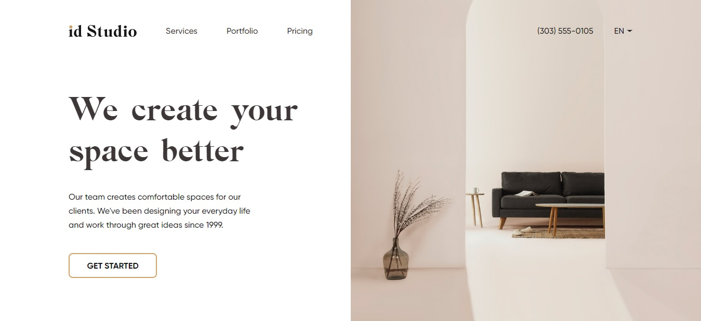
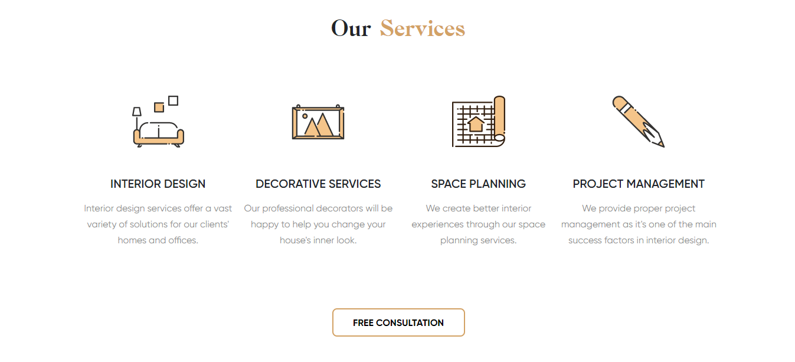
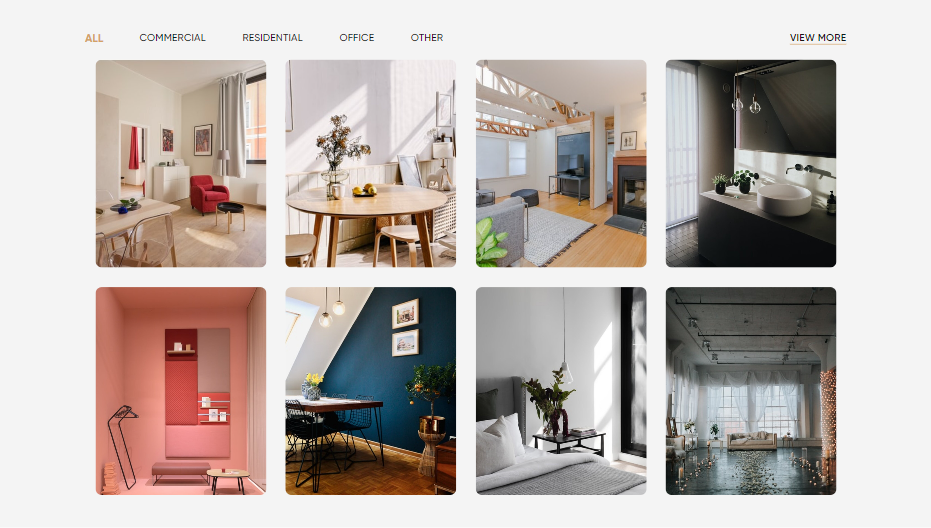
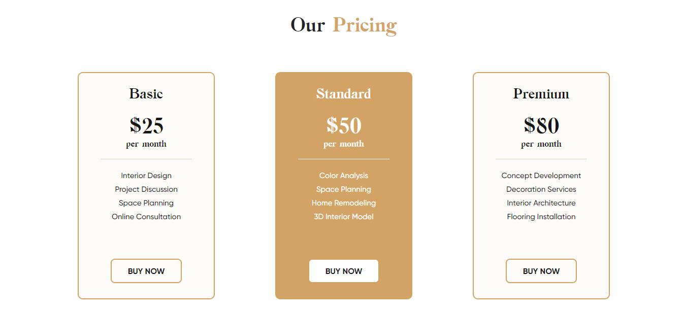

# _Interior Design Studio_

---

## About Project

##### This website is the landing page of an imaginary company that provides services in: interior design, decorative services, space planning and project management.

&nbsp;

##### Here you can view the portfolio with finished projects of this company 

&nbsp;

##### The three levels of subscription plans

&nbsp;

##### You can also order a call

---

## Goal of this project

- **Gain experience in website layout**
- **Improve JavaScript skills**
- **Learn to create responsive design**
- **Learn to make layouts according to the mobile-first principle**

---

## _Technologies stack_

- **HTML**
- **SCSS/CSS**
- **JavaScript (JQuery)**
- **Bootstrap**

---

- Follow this link [https://dmytrotruten.github.io/Interior-Design-Studio/](https://dmytrotruten.github.io/Interior-Design-Studio/)

---
